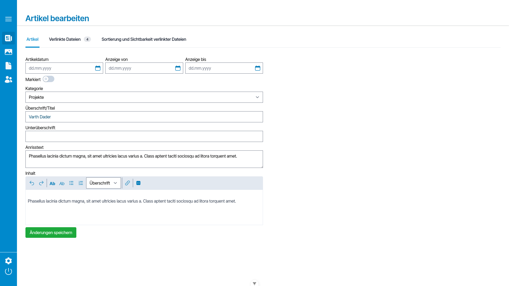

# vxWeb Client #

The prior version of _vxWeb_ is a simple CMS which both provided server- and client-site functionality. 
This client is a [Vue](https://vuejs.org) SPA which works with a separate [vxWeb Server](https://github.com/Vectrex/vxWeb) application via a REST API.
Styling is handled with [Tailwind CSS](https://tailwindcss.com), authentication is handled with a JWT.

vxWeb Client rides on top of [tiptap](https://tiptap.dev) for rich text editing and [vxVue](https://github.com/Vectrex/vxVue) for the basic UI components.

## Screenshots ##

### Login ###

### Articles List and Editor ###

### File Manager ###

### Static Pages Editor ###
